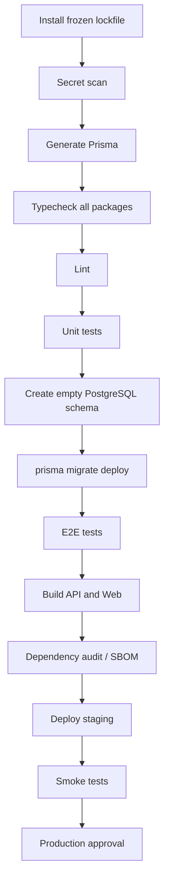

# Plano de Remediação da Auditoria

**Projeto:** Master Finance SaaS  
**Documento relacionado:** `docs/auditoria/RELATORIO-AUDITORIA-TECNICA.md`  
**Objetivo:** converter os achados em um plano incremental, seguro para uma aplicação já implantada.

---

## 1. Princípios de execução

1. **Não corrigir dados financeiros diretamente sem reconciliação e backup.** Mudanças de `Float` para `Decimal`, estoque e cascatas exigem plano de migração e validação com dados reais.
2. **Aplicar contenções antes de refatorar arquitetura.** Fechar bypasses e XSS não depende de uma Clean Architecture completa.
3. **Separar identities de banco:** deploy com DDL; aplicação com DML mínimo.
4. **Executar mudanças de schema em expand/contract.** Adicionar estrutura, fazer backfill, validar, mudar tráfego e só então remover legado.
5. **Feature flags para alterações de regra financeira.** Permitem comparação entre cálculo antigo e novo antes do corte.
6. **Deny-by-default.** Novos papéis ou rotas não recebem acesso implícito.
7. **Sem deploy se typecheck, migration smoke test, testes ou build falharem.**

---

## 2. Fase 0 — Contenção imediata (0–72 horas)

| Item | Ação | Achados | Responsável sugerido | Critério de aceite |
|---|---|---|---|---|
| P0.1 | Bloquear rotas de caixa e transações por ability/escopo | A-01 | Back-end + Segurança | Matriz de testes nega todos os papéis não autorizados e outra unidade |
| P0.2 | Corrigir `GET /users` para escopo do `FISCAL` | A-01 | Back-end | `FISCAL` nunca recebe usuário de outra unidade |
| P0.3 | Remover `document.write` com dados não confiáveis ou aplicar escape temporário | A-02 | Front-end | Payloads XSS aparecem como texto e nenhum script executa |
| P0.4 | Desabilitar autorregistro se não for requisito | M-05 | Produto + Back-end | `POST /users` público removido ou protegido por convite |
| P0.5 | Remover senha padrão `123`; gerar senha temporária aleatória | A-06 | Back-end | Dois resets produzem segredos diferentes, com troca obrigatória |
| P0.6 | Rotacionar credencial do seed se já utilizada | M-13 | Infra + Segurança | Credencial antiga recusada em todos os ambientes |
| P0.7 | Remover retorno de `error.message`, arquivo `/tmp` e debug de transação | M-10 | Back-end | 500 contém apenas código seguro + request ID |
| P0.8 | Restringir `/docs` e origem CORS em produção | M-05 | Infra + Back-end | Swagger inacessível fora da rede/papel definido; CORS allowlist |
| P0.9 | Atualizar Next.js e dependências altas diretamente corrigíveis | A-07 | Front-end + Plataforma | Novo audit documentado e builds/testes verdes |

### Patch provisório de autorização

Enquanto o serviço central de autorização não existir, todas as rotas sensíveis devem seguir o mesmo padrão:

```ts
const actor = await loadActor(request)
const ability = defineAbilityFor(actor)
const resource = await repository.findAuthorizationView(id)

if (!resource) throw new ResourceNotFoundError()
if (ability.cannot(action, subject(resourceType, resource))) {
  throw new ForbiddenError()
}
```

Para listagens, aplique escopo no `where` antes de consultar:

```ts
const where = actor.hasGlobalScope
  ? requestedFilters
  : { ...requestedFilters, unitId: actor.unitId }
```

### Testes mínimos de contenção

```text
ADMIN       → pode operar recursos globais
MANAGER     → somente ações definidas na policy
FINANCIAL   → caixa/métricas conforme policy
EMPLOYEE    → transação apenas da própria unidade
SELLER      → caixa/transação apenas da própria unidade e regras de ownership/status
COLLECTOR   → apenas coletas da própria unidade
FISCAL      → usuários da própria unidade e coletas conforme policy
INVENTORY   → sem acesso implícito a caixas/usuários/avaliações
```

---

## 3. Fase 1 — Integridade do banco e dados financeiros (semana 1–2)

## 3.1 Corrigir drift e processo de migration

1. Fazer backup e executar `prisma migrate status` no ambiente implantado.
2. Comparar schema real com migrations, especialmente `evaluations.clientName`.
3. Criar migration reparadora, sem editar migration aplicada:

```sql
ALTER TABLE "evaluations"
ADD COLUMN IF NOT EXISTS "clientName" TEXT;
```

4. Remover todo DDL de handlers.
5. Criar script de produção:

```json
{
  "db:migrate:deploy": "pnpm env:load prisma migrate deploy"
}
```

6. Revogar DDL do usuário da aplicação após confirmar processo de deploy.

**Critério de aceite:** banco vazio recebe todas as migrations; smoke test cria/lê avaliação; aplicação inicia com usuário sem DDL.

## 3.2 Corrigir semântica financeira

Decisão de domínio necessária:

- `Transaction.value` representa preço unitário? As evidências indicam que sim.
- O preço histórico pode mudar após a transação? Recomendação: não.
- O saldo é calculado por unidade, setor ou ambos?

Modelo sugerido:

```prisma
model Transaction {
  id        String          @id @default(uuid())
  type      TransactionType
  date      DateTime        @db.Timestamptz(3)
  unitPrice Decimal         @db.Decimal(19, 4)
  quantity  Int
  // ...
}
```

Plano expand/contract:

1. Adicionar `unitPrice Decimal?`.
2. Backfill com `value` arredondado segundo regra aprovada.
3. Comparar totais antigos/novos em shadow mode.
4. Alterar escrita/leitura para `unitPrice`.
5. Tornar `unitPrice` obrigatório.
6. Remover `value` em release posterior.

**Critério de aceite:** o mesmo fixture retorna totais idênticos em resumo, fluxo diário, dashboard, top itens e relatório executivo.

## 3.3 Implementar estoque por unidade

Modelo sugerido:

```prisma
model UnitInventory {
  unitId    String
  itemId    String
  quantity  Int      @default(0)
  version   Int      @default(0)
  updatedAt DateTime @updatedAt

  unit Unit @relation(fields: [unitId], references: [id], onDelete: Restrict)
  item Item @relation(fields: [itemId], references: [id], onDelete: Restrict)

  @@id([unitId, itemId])
  @@index([itemId])
}
```

Plano:

1. Definir regra para `Item.quantity` legado e distribuir/backfill por unidade.
2. Criar projeção `UnitInventory`.
3. Comparar projeção com ledger atual e resolver divergências.
4. Passar ENTRY/EXIT a atualizar saldo e ledger na mesma transação.
5. Impedir update destrutivo; preferir estorno + novo evento.
6. Criar testes concorrentes.

**Critérios de aceite:** duas saídas simultâneas não geram saldo negativo; lote com item repetido é agrupado ou rejeitado; saldo é independente por unidade.

## 3.4 Preservar histórico

1. Mapear todas as cascatas e dependências.
2. Trocar cascata financeira por `Restrict`.
3. Adicionar `deletedAt`/`isActive` a entidades mestres.
4. Preservar snapshot do ator no audit log.
5. Definir fluxo de desativação no front-end.

**Critério de aceite:** desativar item/unidade/usuário não remove transações, caixas, coletas ou auditoria.

---

## 4. Fase 2 — Sessão, segurança e auditoria (semana 2–3)

## 4.1 Sessões revogáveis

Adicionar:

```prisma
model User {
  // ...
  tokenVersion Int @default(0)
}
```

JWT:

```ts
const token = await reply.jwtSign(
  {
    sub: user.id,
    tokenVersion: user.tokenVersion,
  },
  {
    sign: {
      expiresIn: '15m',
      iss: 'master-finance-api',
      aud: 'master-finance-web',
      jti: randomUUID(),
    },
  }
)
```

Incrementar `tokenVersion` em:

- reset de senha;
- troca de senha;
- desativação do usuário;
- encerramento administrativo de sessões.

**Critério de aceite:** JWT emitido antes do reset é recusado; usuário com `forcePasswordChange` só acessa perfil mínimo, logout e troca de senha.

## 4.2 Política de credencial

- 12–128 caracteres ou passphrase equivalente.
- Lista de senhas comuns.
- bcrypt 12 calibrado no hardware ou Argon2id.
- Senha temporária one-time.
- Rate limiting de login.
- Registro de tentativas sem armazenar senha.

**Critério de aceite:** benchmark não causa indisponibilidade; força bruta é limitada; senha temporária não é previsível.

## 4.3 Auditoria confiável

Modelo recomendado:

```prisma
model AuditLog {
  id            String   @id @default(uuid())
  actorUserId   String?
  actorUsername String
  action        String
  resource      String
  resourceId    String?
  unitId        String?
  requestId     String
  metadata      Json
  createdAt     DateTime @default(now()) @db.Timestamptz(3)

  actor User? @relation(fields: [actorUserId], references: [id], onDelete: SetNull)

  @@index([createdAt, id])
  @@index([resource, action, createdAt])
  @@index([actorUserId])
}
```

- Operação crítica + audit log na mesma transação.
- Outbox para envio a SIEM/WORM.
- Redaction de PII.
- Política de retenção.

**Critério de aceite:** falha de auditoria em operação crítica impede commit ou gera outbox transacional; remoção de usuário não apaga histórico.

## 4.4 Hardening web/API

- CSP em `Report-Only`, depois enforcement.
- `X-Content-Type-Options`, `Referrer-Policy`, `Permissions-Policy`, `frame-ancestors`.
- CORS allowlist.
- Swagger condicionado a `ENABLE_SWAGGER` e/ou rede autenticada.
- Cookie `HttpOnly`, `Secure`, `SameSite` explícitos.
- Logout via Server Action.

---

## 5. Fase 3 — Performance e arquitetura (semana 3–6)

## 5.1 Índices prioritários

```prisma
model Transaction {
  @@index([unitId, month, type])
  @@index([itemId, unitId, date])
  @@index([unitId, date, id])
  @@index([sectorId])
  @@index([userId])
  @@index([batchId])
}

model CashClosure {
  @@index([unitId, status, cashDate])
  @@index([sectorId])
  @@index([userId])
}

model Collection {
  @@index([unitId, requestDate])
  @@index([collectorId])
  @@index([userId])
}

model Evaluation {
  @@index([sellerId, createdAt])
  @@index([unitId, createdAt])
}
```

> Validar índices com dados representativos. Índice em excesso aumenta custo de escrita.

## 5.2 Paginação e agregação

- Cursor-based para transações, logs e avaliações.
- Offset limitado pode permanecer em catálogos pequenos.
- Agregar no banco.
- Exigir intervalo de data nos relatórios globais.
- Avaliar materialized views somente após medir.

**SLO inicial sugerido:** p95 de listagens < 500 ms e relatórios usuais < 2 s no volume atual.

## 5.3 Modularização incremental

Ordem:

1. `transactions` — maior risco de domínio.
2. `cash-closures` — maior risco de autorização.
3. `auth/users` — sessão e ABAC.
4. `evaluations` — componente/handler grande e fluxo público.
5. `metrics` — cálculo único e agregação.

Interfaces mínimas:

```ts
interface TransactionRepository {
  createWithInventoryChange(input: MovementInput): Promise<MovementResult>
}

interface AuthorizationService {
  assertCan(actor: Actor, action: Action, resource: Resource): void
  scopeFor(actor: Actor, resource: ResourceType): QueryScope
}

interface AuditWriter {
  append(event: AuditEvent, tx?: TransactionContext): Promise<void>
}
```

Evitar abstrair Prisma em CRUDs sem regra apenas por dogma. O ganho deve ser isolamento de invariantes e testabilidade.

## 5.4 Contratos compartilhados

Criar:

```text
packages/contracts/
├── src/common.ts
├── src/auth.ts
├── src/transactions.ts
├── src/cash-closures.ts
└── src/index.ts
```

Schemas-base:

```ts
export const uuidSchema = z.string().uuid()
export const monthSchema = z.string().regex(/^\d{4}-(0[1-9]|1[0-2])$/)
export const nonBlankString = z.string().trim().min(1)
export const paginationQuery = z.object({
  cursor: uuidSchema.optional(),
  limit: z.coerce.number().int().min(1).max(100).default(20),
})
```

---

## 6. Fase 4 — Front-end, UX e acessibilidade (semana 4–7)

1. Substituir erro silencioso por error boundaries e estados explícitos.
2. Configurar `API_URL` validada.
3. Memoizar `auth()` por request e passar user pelo layout.
4. Renderizar `UnitSwitcher` apenas para perfis globais; validar no servidor.
5. Definir cache por recurso:
   - financeiro/autenticado: `no-store`;
   - catálogo estável: tags + TTL;
   - mutations: invalidar path/tag coerente.
6. Eliminar props duplicadas em `useState` ou sincronizar mutation explicitamente.
7. Dividir `evaluations-content.tsx`, `settings-content.tsx` e dialogs grandes.
8. Importar PDF/gráficos sob demanda.
9. Corrigir controles semânticos, labels e navegação por teclado.
10. Criar sidebar móvel e corrigir classes Tailwind inválidas.

**Critérios de aceite:**

- Erro da API nunca aparece como saldo zero sem aviso.
- Logout do perfil remove a sessão.
- Fluxos funcionam em viewport móvel.
- axe sem violações críticas nas rotas principais.
- Testes cobrem login/logout, mutation/revalidation e exportação segura.

---

## 7. Pipeline mínima recomendada



Scripts raiz sugeridos:

```json
{
  "scripts": {
    "check-types": "turbo run check-types",
    "test": "turbo run test",
    "test:e2e": "pnpm --filter @saas/api test:e2e",
    "build": "turbo run build",
    "quality": "pnpm check-types && pnpm lint && pnpm test && pnpm build"
  }
}
```

Gates obrigatórios:

- TypeScript: 0 erros.
- Lint: 0 erros novos; zerar baseline existente em tarefa dedicada.
- Unitários: 100% verdes.
- Migration em banco vazio: verde.
- Web/API build: verde.
- Nenhuma vulnerabilidade alta explorável sem exceção formal.

---

## 8. Estratégia de rollout no servidor atual

### Antes de qualquer migration financeira

- Backup lógico e snapshot/backup físico validado.
- Teste de restauração.
- Exportação de totais por unidade/mês para baseline.
- Janela de manutenção ou escrita dupla controlada.
- Plano de rollback documentado.

### Shadow mode para cálculos

Por uma janela definida, calcular resultado antigo e novo sem mudar a UI:

```ts
const legacy = legacyFinancialSummary(transactions)
const candidate = await newFinancialSummary(query)

if (!candidate.equals(legacy)) {
  metrics.financialMismatch.increment({ unitId, month })
}
```

Não registrar dados pessoais no mismatch; apenas identificadores controlados e diferenças agregadas.

### Canary

1. Staging com cópia anonimizada/volume representativo.
2. Uma unidade piloto.
3. Monitorar erros, divergência de saldo, locks e p95.
4. Expandir gradualmente.

---

## 9. Indicadores de conclusão

| Indicador | Estado auditado | Meta |
|---|---:|---:|
| Erros TypeScript da API | 16 | 0 |
| Erros de lint | 48 | 0 |
| Testes unitários API | 71/71 passam | manter + ampliar casos críticos |
| Testes web | 0 | fluxos críticos cobertos |
| Índices Prisma explícitos | 0 | índices validados por workload |
| Vulnerabilidades altas reportadas | 19 | 0 exploráveis sem exceção |
| Rotas com ABAC não uniforme | múltiplas | 0 |
| Exportadores com `document.write` não confiável | múltiplos | 0 |
| Senha temporária universal | presente | removida |
| JWT revogável | não | sim |
| DDL em request | presente | 0 |
| Audit log transacional crítico | não | sim |

---

## 10. Definition of Done por achado

Um achado só deve ser marcado como resolvido quando:

1. Código corrigido e revisado.
2. Teste de regressão adicionado.
3. Contrato/documentação atualizados.
4. Migration validada em banco vazio e cópia representativa, quando aplicável.
5. Observabilidade/alerta definidos para falhas relevantes.
6. Evidência de deploy em staging anexada.
7. Critério de aceite deste plano demonstrado.
8. Risco residual documentado e aceito pelo responsável quando não puder ser eliminado.
