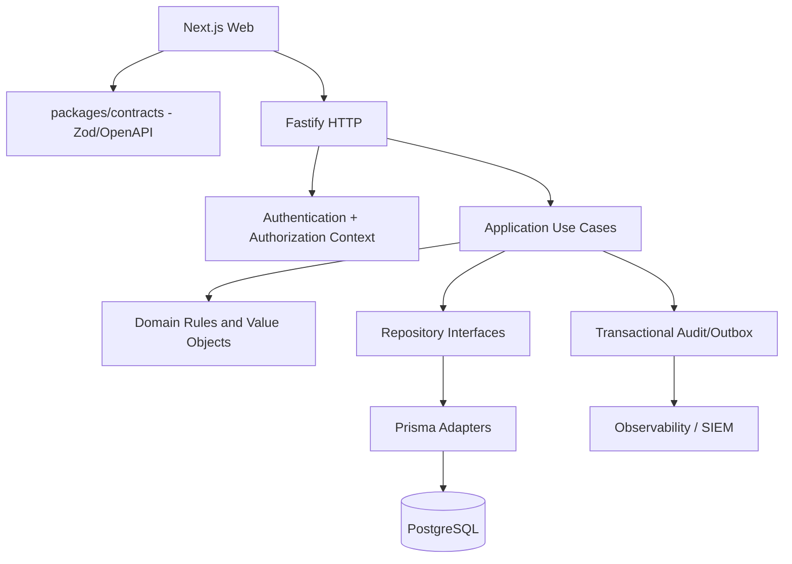

# Relatório de Auditoria Técnica, Arquitetural e de Segurança

**Projeto:** Master Finance SaaS  
**Arquitetura declarada:** Monorepo — Node.js/Fastify + Prisma + Zod e React/Next.js  
**Data da auditoria:** 26 de agosto de 2026  
**Tipo de análise:** Revisão estática do código, configuração, banco, contratos, testes e dependências  
**Classificação geral:** **RISCO ALTO / SAÚDE GERAL MODERADA**

> Este relatório considera explicitamente que a aplicação opera em infraestrutura própria, com público predominantemente interno e acesso controlado. Isso reduz a probabilidade de ataques oportunistas externos, mas não elimina riscos de credenciais comprometidas, abuso interno, erro operacional, estação infectada ou exposição acidental no proxy/firewall. O reset de senha por administradores foi aceito como regra de negócio; os achados tratam dos controles compensatórios desse fluxo, e não da existência do fluxo em si.

---

## 1. Resumo executivo

A solução possui uma base tecnológica moderna e adequada ao porte atual: TypeScript em modo estrito, Fastify com Zod Type Provider, Prisma, PostgreSQL, CASL centralizado, Server Components/Server Actions, cookies `HttpOnly`, migrations versionadas e testes unitários no back-end. O build de produção do front-end foi concluído com sucesso e os 71 testes unitários da API passaram.

Apesar dessas bases, a aplicação apresenta riscos relevantes para integridade e confidencialidade dos dados financeiros:

1. **O RBAC/ABAC não é aplicado consistentemente nas rotas.** Algumas listagens verificam apenas se o papel conhece o tipo de recurso, mas não aplicam as condições de unidade; outras rotas de fechamento de caixa não consultam CASL. Há cenários em que papéis sem permissão podem ler, criar, alterar ou excluir dados financeiros.
2. **O estoque não é protegido contra concorrência.** O saldo é calculado fora da transação, com uma query por item, e `Item.quantity` é global enquanto as movimentações são por unidade. Duas saídas simultâneas podem produzir estoque negativo.
3. **Os relatórios financeiros discordam entre si.** Alguns endpoints calculam `value * quantity`; outros somam apenas `value`. Dinheiro é armazenado em `Float`, inadequado para conciliação financeira.
4. **Existe XSS armazenado na exportação/impressão de avaliações.** Dados públicos são interpolados em HTML e enviados a `document.write`, podendo executar código quando um usuário privilegiado exportar o relatório.
5. **Migrations e schema divergem e handlers executam DDL.** A coluna `Evaluation.clientName` existe no schema, mas não na migration correspondente. Rotas tentam reparar schema em tempo de request e mascaram erros de banco.
6. **Controles de credencial e sessão são insuficientes.** O reset usa senha universal `123`, bcrypt cost 6, mínimo de quatro caracteres, obrigação de troca apenas na UI e JWT não revogável por sete dias.
7. **A pipeline não impede código inválido.** O “build” da API apenas gera o Prisma Client; o typecheck atual falha com 16 erros e o lint com 48 erros. Não foi encontrada configuração de CI.
8. **O schema não possui índices operacionais.** Nenhum `@@index` foi encontrado, embora relatórios e listagens filtrem grandes tabelas por unidade, mês, data, tipo e usuário.
9. **A observabilidade pode vazar dados.** Todas as queries Prisma são logadas fora de testes, há debug de transações no console e erros completos são gravados em `/tmp` e parcialmente devolvidos ao cliente.
10. **A dívida de front-end afeta confiabilidade e acessibilidade.** Falhas HTTP são convertidas em zeros/listas vazias, o logout do perfil tenta apagar cookie `HttpOnly` no cliente, a API está fixa em `localhost`, há consultas redundantes de perfil, componentes com mais de mil linhas e ausência de testes web.

### Veredito

A aplicação pode continuar operando em ambiente interno enquanto um plano corretivo é executado, mas recomenda-se tratar imediatamente os achados **A-01 a A-06**, porque eles afetam autorização, integridade financeira, estoque, XSS, banco e credenciais. O caráter interno deve ser usado como camada adicional de defesa, não como substituto de autorização server-side, integridade transacional e gestão segura de credenciais.

---

## 2. Visão consolidada de risco

| ID | Severidade | Categoria | Achado |
|---|---|---|---|
| A-01 | ALTA | Segurança | RBAC/ABAC e isolamento por unidade podem ser contornados |
| A-02 | ALTA | Segurança | XSS armazenado em relatórios e impressão de avaliações |
| A-03 | ALTA | Banco de Dados | Estoque sujeito a concorrência, N+1 e saldo global incorreto |
| A-04 | ALTA | Banco de Dados | Totais financeiros inconsistentes e dinheiro em `Float` |
| A-05 | ALTA | Banco de Dados | Drift de migration e DDL executado durante requests |
| A-06 | ALTA | Segurança | Senhas temporárias previsíveis, hash fraco e JWT não revogável |
| A-07 | ALTA | Segurança | Dependências de produção com vulnerabilidades conhecidas |
| A-08 | ALTA | Banco de Dados | Exclusões em cascata apagam histórico financeiro e auditoria |
| M-01 | MÉDIA | Banco de Dados | Ausência de índices, paginação incompleta e agregações em memória |
| M-02 | MÉDIA | Back-end | Contratos HTTP e tratamento de erros inconsistentes |
| M-03 | MÉDIA | Segurança | Auditoria não transacional, apagável e com falha silenciosa |
| M-04 | MÉDIA | Arquitetura | Regras de domínio e infraestrutura concentradas em handlers |
| M-05 | MÉDIA | Segurança | Cadastro/login/avaliação sem proteção antiabuso suficiente |
| M-06 | MÉDIA | Back-end | Build da API não compila nem valida tipos; CI ausente |
| M-07 | MÉDIA | Front-end | Falhas HTTP são apresentadas como dados vazios ou saldo zero |
| M-08 | MÉDIA | Front-end | Fluxo de sessão, API URL e unidade ativa têm inconsistências |
| M-09 | MÉDIA | Front-end | Cache/revalidação, estado e chamadas de perfil são ineficientes |
| M-10 | MÉDIA | Segurança | Logs e erros podem expor SQL, PII e detalhes internos |
| M-11 | MÉDIA | Banco de Dados | Datas, mês de referência e timezone são inconsistentes |
| M-12 | MÉDIA | Arquitetura | Contratos e validações são duplicados entre apps e packages |
| M-13 | MÉDIA | Segurança | Bootstrap e configuração contêm credenciais fixas ou fracas |
| B-01 | BAIXA | Front-end | Acessibilidade, responsividade e semântica de controles |
| B-02 | BAIXA | Back-end | Cobertura de testes não protege fluxos críticos |
| B-03 | BAIXA | Arquitetura | Artefatos de debug e configuração permissiva de lint |

---

## 3. Achados de severidade ALTA

## A-01 — RBAC/ABAC e isolamento por unidade podem ser contornados

**Severidade:** ALTA  
**Categoria:** Segurança

### O Problema

As regras de autorização estão centralizadas em `packages/auth/src/permissions.ts`, o que é uma boa direção, porém várias rotas não aplicam essas regras ou verificam apenas o tipo do recurso sem testar suas condições.

Evidências:

- `packages/auth/src/permissions.ts:41-69` define restrições por `unitId` para `EMPLOYEE`, `SELLER`, `COLLECTOR` e `FISCAL`.
- `apps/api/src/http/routes/transactions/get-transactions.ts:82-98` restringe apenas `EMPLOYEE`; `COLLECTOR`, `FISCAL`, `SELLER` e outros papéis podem consultar um conjunto global ou uma unidade informada pelo cliente.
- `apps/api/src/http/routes/users/get-users.ts:79-106` chama `ability.cannot('get', 'User')`, mas não aplica a condição de unidade do `FISCAL` no `where`.
- `apps/api/src/http/routes/cash-closures/create-cash-closure.ts:45-80` aceita `unitId`, `sectorId` e usuário-alvo sem verificar ability nem vínculo entre eles.
- `apps/api/src/http/routes/cash-closures/delete-cash-closure.ts:32-58` bloqueia apenas `SELLER` e `EMPLOYEE`; papéis sem permissão explícita de caixa podem excluir qualquer registro cujo UUID conheçam.
- O typecheck falha em `packages/auth/src/permissions.ts:69`, indicando que o subject `User` não está modelado para condições ABAC de forma type-safe.

O padrão “nega apenas alguns papéis” é inseguro: novos papéis passam a ter acesso por default. O padrão correto é “nega por default e permite apenas quando a policy autoriza”.

**Impacto:** leitura entre unidades, alteração/exclusão de fechamentos, exposição de usuários, quebra de segregação de funções e possível violação de isolamento SaaS. UUID não é controle de autorização.

### A Solução Proposta

1. Criar um contexto autenticado central (`actor`, `ability`, `requestId`) em `preHandler`.
2. Em listagens, derivar o filtro de unidade da policy no servidor; nunca confiar no cookie/query para usuários locais.
3. Em operações por ID, carregar o recurso mínimo e verificar a ability contra o objeto real.
4. Adotar deny-by-default e retornar `403 Forbidden` para sessão válida sem permissão.
5. Modelar todos os subjects CASL como objetos discriminados e remover `as any`.
6. Avaliar `@casl/prisma`/`accessibleBy` ou um `AuthorizationService` próprio.
7. Criar testes matriciais: `papel × ação × própria unidade × outra unidade`.
8. Se `Unit` representar tenant real, avaliar PostgreSQL Row-Level Security como defesa em profundidade.

### Exemplo Prático (Antes/Depois)

**Antes — filtro controlado pelo cliente e exceção apenas para `EMPLOYEE`:**

```ts
let { unitId, itemId, month, type } = request.query

if (requestingUser.role === 'EMPLOYEE') {
  unitId = requestingUser.unitId
}

const transactions = await prisma.transaction.findMany({
  where: { unitId, itemId, month, type },
})
```

**Depois — escopo derivado da policy:**

```ts
const actor = await authenticatedActor(request)
const ability = defineAbilityFor(actor)

if (ability.cannot('get', 'Transaction')) {
  throw new ForbiddenError('Sem permissão para consultar movimentações.')
}

const requestedUnitId = request.query.unitId
const unitId = actor.hasGlobalTransactionScope
  ? requestedUnitId
  : actor.unitId

if (!unitId && !actor.hasGlobalTransactionScope) {
  return reply.send({ transactions: [], nextCursor: null })
}

const transactions = await prisma.transaction.findMany({
  where: { unitId, itemId, month, type },
  orderBy: [{ date: 'desc' }, { id: 'desc' }],
})
```

---

## A-02 — XSS armazenado em relatórios e impressão de avaliações

**Severidade:** ALTA  
**Categoria:** Segurança

### O Problema

A rota pública de avaliação persiste `clientName`, `presetComment` e `observation`. Esses valores são interpolados diretamente em strings HTML no front-end e gravados em uma janela com `document.write`.

Evidências:

- `apps/web/src/app/(app)/evaluations/download-evaluations-pdf.ts:42-68` interpola nome, vendedor, unidade e comentário sem escape.
- `apps/web/src/app/(app)/evaluations/download-evaluations-pdf.ts:252-254` interpola filtros em HTML.
- `apps/web/src/app/(app)/evaluations/download-podium-pdf.ts` repete o padrão.
- `apps/web/src/app/(app)/evaluations/qr-code-card.tsx:154-268` interpola `sellerName` e `evaluationUrl`, usa `document.write` e carrega JavaScript remoto sem SRI.
- `apps/api/src/http/routes/evaluations/create-evaluation.ts` recebe dados de usuário não autenticado.
- Não há CSP no `apps/web/next.config.ts`.

Um payload como `` pode executar quando ADMIN/MANAGER exportar o relatório. O cookie `HttpOnly` impede sua leitura direta, mas o script ainda pode realizar ações autenticadas na mesma origem.

### A Solução Proposta

1. Eliminar HTML manual e renderizar um componente React imprimível com `react-to-print`, já instalado.
2. Reutilizar `qrcode.react`; não carregar gerador de QR remoto no popup.
3. Limitar tamanho dos campos no Zod do back-end e no schema compartilhado.
4. Aplicar CSP após remover scripts inline, inicialmente em `Report-Only`.
5. Se string HTML for inevitável, escapar todos os dados dinâmicos contextualmente e abrir popup com `noopener,noreferrer`.
6. Adicionar testes com payloads de fechamento de tags, eventos HTML e caracteres especiais.

### Exemplo Prático (Antes/Depois)

**Antes:**

```ts
const comment = ev.observation ?? ev.presetComment
const row = `<td>${ev.clientName}</td><td>${comment}</td>`
printWindow.document.write(`<table>${row}</table>`)
```

**Depois — React faz escape por default:**

```tsx
function PrintableEvaluations({ evaluations }: Props) {
  return (
    <table>
      <tbody>
        {evaluations.map((evaluation) => (
          <tr key={evaluation.id}>
            <td>{evaluation.clientName ?? 'Anônimo'}</td>
            <td>{evaluation.observation ?? evaluation.presetComment}</td>
          </tr>
        ))}
      </tbody>
    </table>
  )
}

const print = useReactToPrint({ contentRef: reportRef })
```

---

## A-03 — Estoque sujeito a concorrência, N+1 e saldo global incorreto

**Severidade:** ALTA  
**Categoria:** Banco de Dados

### O Problema

Em `apps/api/src/http/routes/transactions/create-transaction.ts:124-175`, o estoque é calculado por item carregando todo o histórico da unidade, fora da transação que grava as saídas. Há quatro problemas combinados:

1. Duas requisições podem ler o mesmo saldo e ambas registrar uma saída.
2. Itens repetidos no mesmo lote são validados isoladamente contra o mesmo saldo.
3. Há uma query adicional por item (N+1) e soma de todo o histórico em Node.js.
4. `Item.quantity` é global (`schema.prisma:95-113`), mas o histórico é por unidade; o mesmo saldo inicial pode ser contado em várias unidades.

`apps/api/src/http/routes/transactions/update-transaction.ts:75-109` ainda permite trocar tipo, item e quantidade sem reverter/aplicar o impacto no estoque.

### A Solução Proposta

1. Definir `UnitInventory`/`InventoryBalance` com chave composta `[unitId, itemId]`.
2. Agrupar itens repetidos antes da validação.
3. Atualizar saldo atomicamente dentro de `$transaction` com condição `quantity >= requested`.
4. Usar isolamento `Serializable` ou locking/controle otimista, com retry para conflitos.
5. Tratar alteração de movimentação como reversão do evento antigo + aplicação do novo, ou tornar o ledger imutável e registrar estorno.
6. Manter `Transaction` como ledger e `UnitInventory` como projeção materializada.

### Exemplo Prático (Antes/Depois)

**Antes:**

```ts
for (const itemReq of items) {
  const pastTransactions = await prisma.transaction.findMany({
    where: { itemId: itemReq.itemId, unitId },
  })

  let currentStock = itemDb.quantity
  for (const tx of pastTransactions) {
    currentStock += tx.type === 'ENTRY' ? tx.quantity : -tx.quantity
  }
}

await prisma.$transaction(writes)
```

**Depois:**

```prisma
model UnitInventory {
  unitId   String
  itemId   String
  quantity Int      @default(0)
  version  Int      @default(0)
  updatedAt DateTime @updatedAt

  unit Unit @relation(fields: [unitId], references: [id], onDelete: Restrict)
  item Item @relation(fields: [itemId], references: [id], onDelete: Restrict)

  @@id([unitId, itemId])
  @@index([itemId])
}
```

```ts
await prisma.$transaction(async (tx) => {
  const changed = await tx.unitInventory.updateMany({
    where: { unitId, itemId, quantity: { gte: requestedQuantity } },
    data: {
      quantity: { decrement: requestedQuantity },
      version: { increment: 1 },
    },
  })

  if (changed.count !== 1) {
    throw new InsufficientStockError(itemId)
  }

  await tx.transaction.create({ data: movementData })
}, { isolationLevel: 'Serializable' })
```

---

## A-04 — Totais financeiros inconsistentes e dinheiro armazenado em `Float`

**Severidade:** ALTA  
**Categoria:** Banco de Dados

### O Problema

O valor da transação é tratado como valor unitário no log (`create-transaction.ts:177-181`). Entretanto:

- `apps/api/src/http/routes/metrics/get-summary.ts:69-98` soma apenas `value`.
- `get-daily-flow.ts` também soma apenas `value`.
- `get-top-items.ts` usa `_sum.value`.
- `get-dashboard-metrics.ts:100-101` e `get-executive-reports.ts` usam `value * quantity`.

Para 10 unidades a R$ 25, alguns endpoints retornam R$ 25 e outros R$ 250. Além disso, `Item.value`, `Transaction.value` e `CashClosure.value` usam `Float`/`DOUBLE PRECISION` (`schema.prisma:99`, `121`, `152`), sujeito a resíduos binários e conciliações inconsistentes.

O dashboard agrupa pelo setor cadastral do item (`get-dashboard-metrics.ts:74-108`), não pelo setor real da transação.

### A Solução Proposta

1. Definir semântica única: `unitPrice`, `quantity` e `lineTotal`.
2. Migrar dinheiro para `Decimal @db.Decimal(19, 4)` ou inteiro em centavos.
3. Centralizar cálculo monetário em um value object/serviço de domínio.
4. Agregar no PostgreSQL com `SUM(unitPrice * quantity)`.
5. Usar `Transaction.sectorId` para classificação histórica.
6. Criar testes de contrato que comparem todos os relatórios sobre o mesmo fixture.

### Exemplo Prático (Antes/Depois)

**Antes:**

```ts
select: { type: true, value: true }

if (t.type === 'ENTRY') entries += t.value
```

**Depois:**

```prisma
model Transaction {
  unitPrice Decimal @db.Decimal(19, 4)
  quantity  Int
}
```

```ts
const totals = await prisma.$queryRaw<FinancialTotal[]>`
  SELECT "type", SUM("unitPrice" * "quantity") AS "total"
  FROM "transactions"
  WHERE "date" >= ${start} AND "date" < ${end}
  GROUP BY "type"
`
```

---

## A-05 — Drift de migration e DDL executado durante requests

**Severidade:** ALTA  
**Categoria:** Banco de Dados

### O Problema

O schema declara `Evaluation.clientName` (`apps/api/prisma/schema.prisma:227`), mas a migration `20260810190510_add_evaluations/migration.sql:5-14` não cria a coluna. Um banco reconstruído apenas com `prisma migrate deploy` pode falhar ao criar ou listar avaliações.

Para contornar drift, `apps/api/src/http/routes/categories/create-category.ts:61-143` verifica dinamicamente o Prisma Client, executa `CREATE TABLE`, `CREATE INDEX` e `ALTER TABLE` em request e usa APIs `Unsafe`. `create-item.ts:85-106` captura qualquer erro e tenta novamente descartando campos. Isso pode transformar timeout, indisponibilidade ou violação de constraint em “compatibilidade com schema antigo”, ocultando incidentes e perdendo dados enviados.

### A Solução Proposta

1. Criar migration reparadora; não editar migration já aplicada.
2. Remover DDL e fallbacks de schema dos handlers.
3. Aplicar `prisma migrate deploy` como etapa obrigatória antes do processo da API.
4. Usar uma identidade de deploy com DDL e uma identidade de runtime apenas com DML.
5. Fazer smoke test de banco vazio em CI.
6. Tratar somente erros Prisma conhecidos (`P2002`, `P2003`, `P2025`) e propagar os demais.
7. Verificar drift do banco em staging/produção antes da migration.

### Exemplo Prático (Antes/Depois)

**Antes:**

```ts
try {
  category = await prisma.category.create({ data: { name } })
} catch {
  await prisma.$executeRawUnsafe(`
    CREATE TABLE IF NOT EXISTS "categories" (...);
    ALTER TABLE "items" ADD COLUMN IF NOT EXISTS "categoryId" TEXT;
  `)
}
```

**Depois:**

```sql
-- Nova migration, sem alterar histórico aplicado
ALTER TABLE "evaluations"
ADD COLUMN "clientName" TEXT;
```

```ts
try {
  return await prisma.category.create({ data: { name } })
} catch (error) {
  if (isPrismaUniqueViolation(error)) {
    throw new ConflictError('Categoria já existe.')
  }
  throw error
}
```

---

## A-06 — Senhas temporárias previsíveis, hash fraco e JWT não revogável

**Severidade:** ALTA  
**Categoria:** Segurança

### O Problema

O reset administrativo é uma regra válida, mas os controles atuais não são suficientes:

- `apps/api/src/http/routes/auth/reset-password.ts:63-81` usa senha universal `123` quando o admin não informa outra.
- Senhas aceitam quatro caracteres e bcrypt usa cost 6 em criação, alteração e reset.
- `forcePasswordChange` é imposto apenas no layout web (`apps/web/src/app/(app)/layout.tsx:11-15`); a API aceita chamadas diretas.
- JWT contém apenas `sub`, vale sete dias e não possui `tokenVersion`, `jti`, `issuer` ou `audience` (`authenticate-with-password.ts:64-71`).
- Reset/troca de senha não invalida tokens já emitidos.
- O cookie é `HttpOnly`, mas não declara explicitamente `secure` e `sameSite` (`apps/web/src/app/auth/sign-in/actions.tsx:20-25`).
- `JWT_SECRET` aceita qualquer string (`packages/env/index.ts:9`).

### A Solução Proposta

1. Gerar senha temporária aleatória ou token de ativação de uso único e curta validade.
2. Exigir passphrase de pelo menos 12 caracteres e bloquear senhas comuns.
3. Calibrar bcrypt para custo 12 ou adotar Argon2id.
4. Manter `forcePasswordChange: true` em todo reset e aplicar o bloqueio na API.
5. Adicionar `tokenVersion`/sessões persistentes e revogar no reset, troca e desligamento.
6. Usar access token curto e refresh rotativo se sessões longas forem necessárias.
7. Exigir segredo JWT com pelo menos 32 bytes de entropia e definir `iss`, `aud` e `jti`.
8. Auditar reset sem registrar a credencial temporária.

### Exemplo Prático (Antes/Depois)

**Antes:**

```ts
const newPasswordHash = await hash(customPassword || '123', 6)

await prisma.user.update({
  data: {
    password_hash: newPasswordHash,
    forcePasswordChange: customPassword ? false : true,
  },
})
```

**Depois:**

```ts
const temporaryPassword = randomBytes(18).toString('base64url')
const passwordHash = await hash(temporaryPassword, 12)

await prisma.user.update({
  where: { id: targetUserId },
  data: {
    password_hash: passwordHash,
    forcePasswordChange: true,
    tokenVersion: { increment: 1 },
  },
})
```

```ts
if (user.forcePasswordChange && !isPasswordChangeRoute(request)) {
  throw new ForbiddenError('É necessário alterar a senha temporária.')
}
```

---

## A-07 — Dependências de produção com vulnerabilidades conhecidas

**Severidade:** ALTA  
**Categoria:** Segurança

### O Problema

`pnpm audit --prod --audit-level high` encontrou **41 vulnerabilidades: 1 baixa, 21 moderadas e 19 altas**. Entre os componentes reportados estão Next.js 16.2.6, `brace-expansion`, `fast-uri`, `hono`, `deepmerge-ts` e dependências transitivas do Prisma/Fastify.

Nem todo advisory é explorável no contexto atual; porém o projeto usa intensivamente Server Actions e possui rotas públicas, o que aumenta a relevância de advisories de DoS e bypass. O ambiente interno reduz exposição, mas não corrige componentes vulneráveis.

### A Solução Proposta

1. Atualizar primeiro Next.js para a release corrigida compatível indicada pelo advisory.
2. Atualizar Prisma, Fastify/Swagger e lockfile em branch de manutenção.
3. Usar `pnpm overrides` apenas para transitivas testadas.
4. Executar build, typecheck, unitários, E2E e smoke tests após atualização.
5. Adicionar SCA contínuo e política de SLA: alta explorável em até 7 dias; demais altas em até 30 dias.
6. Documentar exceções com validade, owner e justificativa quando advisory não for aplicável.

### Exemplo Prático (Antes/Depois)

**Antes:**

```json
{
  "dependencies": {
    "next": "16.2.6"
  }
}
```

**Depois — versão deve ser confirmada no momento da correção:**

```json
{
  "dependencies": {
    "next": ">=16.2.11"
  },
  "pnpm": {
    "overrides": {
      "fast-uri": ">=3.1.3",
      "brace-expansion": ">=5.0.7"
    }
  }
}
```

---

## A-08 — Exclusões em cascata apagam histórico financeiro e auditoria

**Severidade:** ALTA  
**Categoria:** Banco de Dados

### O Problema

O schema usa `onDelete: Cascade` em registros que deveriam compor histórico:

- Item → transações (`schema.prisma:124-125`).
- Unidade → transações, fechamentos e coletas.
- Usuário → audit logs (`schema.prisma:204-205`).
- Vendedor → avaliações.

Rotas como `delete-unit.ts` e `delete-item.ts` fazem hard delete. Uma exclusão administrativa pode apagar ledger financeiro, fechamentos, coletas e a própria evidência de auditoria. Isso prejudica reconciliação, investigação e não repúdio.

### A Solução Proposta

1. Trocar `Cascade` por `Restrict` nos ledgers financeiros.
2. Usar desativação/soft delete (`deletedAt`, `isActive`) para usuários, unidades, itens e setores.
3. Preservar snapshots históricos de nome/unidade quando necessário.
4. Em `AuditLog`, usar ator nullable com `onDelete: SetNull` e snapshot do ator.
5. Tornar logs append-only e, para eventos críticos, exportá-los a storage imutável/SIEM.
6. Definir política formal de retenção alinhada aos requisitos financeiros e de privacidade.

### Exemplo Prático (Antes/Depois)

**Antes:**

```prisma
item Item @relation(
  fields: [itemId],
  references: [id],
  onDelete: Cascade
)
```

**Depois:**

```prisma
item Item @relation(
  fields: [itemId],
  references: [id],
  onDelete: Restrict
)

model Item {
  // ...
  deletedAt DateTime?
}

model AuditLog {
  userId        String?
  actorUsername String
  user User? @relation(fields: [userId], references: [id], onDelete: SetNull)
}
```

---

## 4. Achados de severidade MÉDIA

## M-01 — Ausência de índices, paginação incompleta e agregações em memória

**Severidade:** MÉDIA  
**Categoria:** Banco de Dados

### O Problema

O schema Prisma possui **zero `@@index`**. PostgreSQL não cria automaticamente índices no lado referenciador das FKs. As queries filtram repetidamente por `unitId`, `month`, `type`, `date`, `itemId`, `status`, `sellerId`, `resource` e `action`.

Listagens de caixas, coletas, unidades, setores e categorias não têm paginação. Transações são truncadas silenciosamente em 100 registros (`get-transactions.ts:91-115`). Relatórios carregam históricos inteiros e agregam em Node.js (`get-dashboard-metrics.ts`, `get-executive-reports.ts`, `get-collections-reports.ts`).

### A Solução Proposta

1. Criar índices alinhados às queries reais e validar com `EXPLAIN (ANALYZE, BUFFERS)`.
2. Paginar todas as coleções; usar cursor para tabelas grandes.
3. Sempre ordenar por campo de negócio + `id` para desempate estável.
4. Agregar no PostgreSQL e considerar views/materialized views para relatórios recorrentes.
5. Definir janela temporal obrigatória para relatórios globais.

### Exemplo Prático (Antes/Depois)

**Antes:**

```ts
const transactions = await prisma.transaction.findMany({
  take: 100,
  orderBy: { date: 'desc' },
})
```

**Depois:**

```prisma
model Transaction {
  // ...
  @@index([unitId, month, type])
  @@index([itemId, unitId, date])
  @@index([unitId, date, id])
  @@index([sectorId])
  @@index([userId])
}
```

```ts
const rows = await prisma.transaction.findMany({
  take: perPage + 1,
  cursor: cursor ? { id: cursor } : undefined,
  skip: cursor ? 1 : 0,
  orderBy: [{ date: 'desc' }, { id: 'desc' }],
})
```

---

## M-02 — Contratos HTTP e tratamento de erros inconsistentes

**Severidade:** MÉDIA  
**Categoria:** Back-end

### O Problema

O mesmo `UnauthorizedError` é usado para autenticação inválida e autorização negada, sempre retornando 401 (`error-handle.ts:32-35`). Recursos ausentes alternam entre 400, 404 e respostas diretas. Há response schemas incompatíveis com os payloads enviados e `as any` para ocultar problemas.

Exemplo grave: `create-cash-closure.ts:58-61` retorna status 201 com mensagem de erro, embora o schema 201 exija `closureId`. O erro 500 inclui `error.message` e o typecheck detecta inconsistências em nove arquivos.

### A Solução Proposta

1. Criar hierarquia única de `AppError` com `status`, `code`, `message` e `details` seguros.
2. Separar 401 (`AuthenticationError`) de 403 (`ForbiddenError`).
3. Padronizar 404, 409 e 422/400.
4. Adotar envelope de erro com `requestId`.
5. Declarar todos os status nos schemas e eliminar `as any`.
6. Nunca devolver detalhes internos no 500.

### Exemplo Prático (Antes/Depois)

**Antes:**

```ts
if (dateObj >= today) {
  return reply.status(201).send({
    message: 'A data do caixa deve ser anterior à data de hoje.',
  } as any)
}
```

**Depois:**

```ts
if (dateObj >= today) {
  throw new DomainValidationError(
    'CASH_DATE_NOT_ALLOWED',
    'A data do caixa deve ser anterior à data de hoje.'
  )
}
```

```json
{
  "error": {
    "code": "CASH_DATE_NOT_ALLOWED",
    "message": "A data do caixa deve ser anterior à data de hoje.",
    "requestId": "req-..."
  }
}
```

---

## M-03 — Auditoria não transacional, apagável e com falha silenciosa

**Severidade:** MÉDIA  
**Categoria:** Segurança

### O Problema

`apps/api/src/lib/audit.ts:24-36` captura qualquer erro e apenas chama `console.error`. Mutações ocorrem antes do log e fora da mesma transação. Os testes passaram mesmo emitindo `Failed to create audit log`, confirmando que a operação pode ser concluída sem trilha. A exclusão de usuário apaga seus logs por cascade. Dados de paciente são duplicados em texto livre no log.

### A Solução Proposta

1. Gravar mutação e evento de auditoria na mesma transação para operações críticas.
2. Para integrações externas, usar outbox transacional.
3. Não apagar eventos quando o usuário for removido; preservar snapshot do ator.
4. Estruturar metadata (`before`, `after`, unidade, IP, requestId) e minimizar PII.
5. Alertar falha de auditoria; definir quando ela deve abortar a operação.
6. Incluir login, reset, alteração de perfil e ações sensíveis no modelo de eventos.

### Exemplo Prático (Antes/Depois)

**Antes:**

```ts
await prisma.user.update({ where: { id }, data })
await logAction({ userId, action: 'UPDATE', resource: 'USER', details })
```

**Depois:**

```ts
await prisma.$transaction(async (tx) => {
  const updated = await tx.user.update({ where: { id }, data })

  await tx.auditLog.create({
    data: {
      userId: actor.id,
      action: 'UPDATE',
      resource: 'USER',
      resourceId: id,
      details: JSON.stringify({ before, after: sanitize(updated) }),
    },
  })
})
```

---

## M-04 — Regras de domínio e infraestrutura concentradas em handlers

**Severidade:** MÉDIA  
**Categoria:** Arquitetura

### O Problema

A API não possui camadas de domínio, casos de uso ou serviços. Handlers importam Prisma, CASL, auditoria, bcrypt e implementam regras financeiras diretamente. `create-transaction.ts` reúne autorização, criação de setor, estoque, persistência, preço e auditoria. `get-evaluations.ts` possui centenas de linhas. No front-end, `evaluations-content.tsx` ultrapassa mil linhas, e outros componentes excedem 700 linhas.

Isso aumenta complexidade ciclomática, duplicação e custo de testes. Mudanças de persistência ou regra de negócio atingem a camada HTTP inteira.

### A Solução Proposta

Adotar refatoração incremental por módulo, sem reescrita total:

```text
apps/api/src/modules/transactions/
├── domain/
│   ├── inventory-balance.ts
│   └── transaction-errors.ts
├── application/
│   ├── create-transaction.ts
│   └── update-transaction.ts
├── infrastructure/
│   └── prisma-transaction-repository.ts
└── http/
    ├── schemas.ts
    └── routes.ts
```

Priorizar módulos com invariantes: transações, caixas, avaliações e autenticação. CRUD simples pode continuar usando Prisma diretamente, desde que authorization e error mapping sejam centralizados.

### Exemplo Prático (Antes/Depois)

**Antes:**

```ts
async (request, reply) => {
  // carrega usuário, cria ability, valida estoque,
  // grava movimentos, atualiza item, cria audit log...
}
```

**Depois:**

```ts
async (request, reply) => {
  const actor = request.authContext.actor
  const result = await createTransaction.execute({
    actor,
    ...request.body,
  })

  return reply.status(201).send({ batchId: result.batchId })
}
```

---

## M-05 — Cadastro, login e avaliação sem proteção antiabuso suficiente

**Severidade:** MÉDIA  
**Categoria:** Segurança

### O Problema

`POST /users`, login, criação de avaliação e consulta pública de vendedor não usam autenticação. Não existe `@fastify/rate-limit`. O README sugere convite/criação administrativa, mas `create-account.ts` permite autorregistro como `EMPLOYEE`.

A avaliação pública não possui CAPTCHA, token de submissão, limite por IP/seller ou limites robustos de tamanho. Em ambiente interno a probabilidade diminui, mas cadastro público pode servir como ponto de entrada caso a API seja exposta por engano ou acessada a partir de uma estação comprometida.

CORS é registrado sem allowlist e Swagger fica sempre aberto em `/docs`. No ambiente controlado, estes dois últimos itens são defesa em profundidade, não a causa primária do risco.

### A Solução Proposta

1. Confirmar se autorregistro é requisito; se não, remover `createAccount` e usar convite/admin.
2. Aplicar rate limit por IP + username no login e por IP + seller nas avaliações.
3. Considerar token de avaliação assinado/de uso único ou CAPTCHA em cenários expostos.
4. Limitar campos públicos no Zod.
5. Restringir CORS por origem e `/docs` por ambiente/rede/autenticação.
6. Monitorar tentativas e volumes anormais.

### Exemplo Prático (Antes/Depois)

**Antes:**

```ts
app.register(createAccount)
app.register(createEvaluation)
```

**Depois:**

```ts
await app.register(rateLimit, { global: false })

app.post('/sessions/password', {
  config: { rateLimit: { max: 5, timeWindow: '1 minute' } },
}, loginHandler)

// Contas são criadas apenas por fluxo administrativo/invite.
```

---

## M-06 — Build da API não compila nem valida tipos; CI ausente

**Severidade:** MÉDIA  
**Categoria:** Back-end

### O Problema

`apps/api/package.json` define `build` como geração do Prisma Client, sem `tsc`. O PM2 executa TypeScript por `tsx` em produção (`ecosystem.config.cjs:5-9`), embora `tsx` e `dotenv-cli` estejam em `devDependencies`. Uma instalação `--prod` pode não iniciar.

O typecheck atual falha com 16 erros em nove arquivos. O lint falha com 48 erros. `turbo.json` declara `check-types`, mas os packages não expõem script consistente. Não foi encontrada pipeline em `.github/workflows`.

### A Solução Proposta

1. Separar `generate`, `check-types`, `build` e `start`.
2. Compilar API para `dist` e executar Node.js sem `tsx` em produção.
3. Adicionar scripts em todos os packages e pipeline obrigatória.
4. Fixar versão mínima de Node compatível com o stack.
5. Bloquear merge/deploy se typecheck, lint, testes, migration smoke test ou build falharem.

### Exemplo Prático (Antes/Depois)

**Antes:**

```json
{
  "build": "pnpm env:load prisma generate"
}
```

**Depois:**

```json
{
  "scripts": {
    "generate": "pnpm env:load prisma generate",
    "check-types": "tsc --noEmit",
    "build": "pnpm generate && tsup src/http/server.ts --format esm --out-dir dist",
    "start": "node dist/http/server.js"
  }
}
```

---

## M-07 — Falhas HTTP são apresentadas como dados vazios ou saldo zero

**Severidade:** MÉDIA  
**Categoria:** Front-end

### O Problema

Páginas capturam erros da API e retornam dados vazios. Exemplos:

- `apps/web/src/app/(app)/items/page.tsx:22-35` converte falhas em lista vazia.
- `apps/web/src/app/(app)/page.tsx:38-48` converte erro de métricas em saldo zero.
- Transações, relatórios e configurações repetem o padrão.

Em um sistema financeiro, “API indisponível” não pode ser indistinguível de “saldo R$ 0,00” ou “nenhuma transação”. Isso pode induzir decisão operacional incorreta.

### A Solução Proposta

1. Propagar falhas críticas para `error.tsx`.
2. Distinguir vazio real, sem autorização, sessão expirada, indisponibilidade e erro parcial.
3. Usar `Promise.allSettled` apenas quando degradação parcial for segura.
4. Exibir timestamp da última atualização e indicador de dados incompletos.
5. Adicionar observabilidade client/server para falhas de fetch.

### Exemplo Prático (Antes/Depois)

**Antes:**

```ts
const metrics = await getDashboardMetrics(token).catch(() => ({
  groups: [],
  totalEntries: 0,
  totalExits: 0,
  totalBalance: 0,
}))
```

**Depois:**

```ts
const metrics = await getDashboardMetrics(token)
// A exceção alcança o error.tsx do segmento.
```

```tsx
export default function ErrorState({ reset }: ErrorProps) {
  return <DataLoadError context="indicadores financeiros" onRetry={reset} />
}
```

---

## M-08 — Fluxo de sessão, API URL e unidade ativa têm inconsistências

**Severidade:** MÉDIA  
**Categoria:** Front-end

### O Problema

- `apps/web/src/http/api-client.ts:3-5` fixa API em `http://localhost:3131`, inviável para várias topologias de produção/container.
- `profile-button.tsx:63-67` tenta remover cookie `HttpOnly` via `document.cookie`; esse logout não encerra a sessão.
- `UnitSwitcher` existe, mas não está renderizado no Header. A unidade ativa fica em cookie sem validação (`unit-switcher-action.ts:5-20`).
- Algumas ações exigem cookie de unidade mesmo quando `user.unitId` já existe.

O cookie de unidade pode representar preferência, mas nunca autoridade. A API deve validar/derivar o escopo.

### A Solução Proposta

1. Validar `API_URL` server-only por ambiente.
2. Centralizar logout em Server Action que remove token e unidade ativa.
3. Definir explicitamente `secure` e `sameSite` no cookie.
4. Renderizar seletor apenas para papéis globais e validar unidade permitida no servidor.
5. Para papéis locais, usar `user.unitId` como fonte do escopo.

### Exemplo Prático (Antes/Depois)

**Antes:**

```ts
export const api = ky.create({ prefix: 'http://localhost:3131' })
document.cookie = 'token=; Max-Age=0; path=/;'
```

**Depois:**

```ts
export const api = ky.create({
  prefixUrl: env.API_URL,
  timeout: 10_000,
})
```

```ts
'use server'
export async function signOutAction() {
  const store = await cookies()
  store.delete('token')
  store.delete('active-unit-id')
  redirect('/auth/sign-in')
}
```

---

## M-09 — Cache/revalidação, estado e chamadas de perfil são ineficientes

**Severidade:** MÉDIA  
**Categoria:** Front-end

### O Problema

`auth()` chama `/profile` e é executado no layout, Header, Sidebar e páginas. Sem memoização por request, uma navegação pode repetir a mesma consulta várias vezes. Algumas requisições combinam `next.tags` com `revalidate: 0`, estratégia ambígua. Componentes copiam props para `useState`; após `revalidatePath`, o estado antigo pode continuar visível.

Componentes grandes importam estaticamente exportadores e gráficos, aumentando bundle/hidratação. Não há testes para validar revalidation e atualização de lista.

### A Solução Proposta

1. Memoizar `auth` com `cache()` do React apenas no escopo da request.
2. Passar `user` do layout para Header/Sidebar quando possível.
3. Definir política explícita por recurso: `no-store` para dados sensíveis/mutáveis; cache com tags para catálogos.
4. Evitar duplicar props em estado ou atualizar a fonte local após mutation.
5. Importar geradores de PDF e gráficos sob demanda.
6. Dividir componentes acima de 500–1000 linhas por responsabilidade.

### Exemplo Prático (Antes/Depois)

**Antes:**

```ts
export async function auth() {
  const token = (await cookies()).get('token')?.value
  return getProfile(token)
}
```

**Depois:**

```ts
import { cache } from 'react'

export const auth = cache(async () => {
  const token = (await cookies()).get('token')?.value
  if (!token) redirect('/auth/sign-in')
  return getProfile(token)
})
```

---

## M-10 — Logs e erros podem expor SQL, PII e detalhes internos

**Severidade:** MÉDIA  
**Categoria:** Segurança

### O Problema

- `apps/api/src/lib/prisma.ts:19-22` registra todas as queries fora de testes.
- `get-transactions.ts:117-121` serializa item de transação no console.
- `error-handle.ts:49-59` grava stack e objeto do erro em `/tmp/api-error.txt` e devolve `error.message` no 500.
- Audit logs contêm nome/código de paciente em texto livre.
- Fastify é criado sem logger estruturado/redaction.

Em servidor interno, processos e operadores ainda podem acessar logs. PII financeira/assistencial precisa de minimização, retenção e controle de acesso.

### A Solução Proposta

1. Ativar logger Fastify/Pino com redaction e correlação por request.
2. Remover debug e query log em produção; registrar apenas erros/slow queries.
3. Não escrever arquivos ad hoc em `/tmp`.
4. Devolver mensagem genérica e `requestId` no 500.
5. Estruturar e minimizar PII na auditoria; definir retenção e acesso.
6. Integrar plataforma de observabilidade/SIEM.

### Exemplo Prático (Antes/Depois)

**Antes:**

```ts
new PrismaClient({ log: ['query'] })
reply.status(500).send({ message: 'Internal server error', error: error.message })
```

**Depois:**

```ts
const app = fastify({
  logger: {
    redact: ['req.headers.authorization', 'password', 'password_hash', 'token'],
  },
})

request.log.error({ err: error, requestId: request.id }, 'Unhandled error')
reply.status(500).send({
  error: { code: 'INTERNAL_ERROR', message: 'Erro interno.', requestId: request.id },
})
```

---

## M-11 — Datas, mês de referência e timezone são inconsistentes

**Severidade:** MÉDIA  
**Categoria:** Banco de Dados

### O Problema

O banco usa `TIMESTAMP(3)` sem timezone e mantém `month` como string redundante. O mês é derivado com timezone local do servidor em transações, enquanto outros relatórios usam UTC. Fechamento compara uma data ISO com “hoje” no timezone do processo. Endpoints misturam `setHours`, `setUTCHours`, `new Date` e Day.js sem timezone de negócio.

Movimentações próximas da meia-noite podem cair em meses/dias diferentes conforme endpoint e configuração do servidor.

### A Solução Proposta

1. Definir timezone de negócio por unidade ou um timezone global documentado.
2. Usar `timestamptz` para instantes e `date` para datas civis como fechamento.
3. Remover `month` e consultar por intervalo `[início, próximo início)`; se mantido, criar constraint e gerá-lo centralmente.
4. Padronizar biblioteca e helpers de data.
5. Criar testes em virada de dia/mês e horário de verão.

### Exemplo Prático (Antes/Depois)

**Antes:**

```ts
const month = `${date.getFullYear()}-${date.getMonth() + 1}`
```

**Depois:**

```prisma
model Transaction {
  date      DateTime @db.Timestamptz(3)
  createdAt DateTime @default(now()) @db.Timestamptz(3)
}

model CashClosure {
  cashDate DateTime @db.Date
}
```

```ts
const { start, end } = monthRangeInZone(referenceMonth, unit.timeZone)
const where = { date: { gte: start, lt: end } }
```

---

## M-12 — Contratos e validações são duplicados entre apps e packages

**Severidade:** MÉDIA  
**Categoria:** Arquitetura

### O Problema

O monorepo compartilha `auth` e `env`, mas não possui package de contratos HTTP/domínio. Enums de role, paginação, UUID, mês, dinheiro e DTOs são repetidos. O front-end usa `.json<Type>()`, que apenas faz cast de TypeScript e não valida o JSON em runtime. `z.any()` e `as any` aparecem em contratos sensíveis.

O package `@saas/auth` aponta `main` diretamente para TypeScript fonte e não possui pipeline própria de build/teste. O pacote `@saas/env` combina utilitário específico de Next com consumo pela API Node, aumentando acoplamento ao framework.

### A Solução Proposta

1. Criar `packages/contracts` com schemas Zod sem dependência de Fastify/Next.
2. Inferir DTOs com `z.infer` no back e front.
3. Separar `env-server` e `env-web`, ou usar solução agnóstica para a API.
4. Gerar cliente tipado via OpenAPI como alternativa/complemento.
5. Versionar e testar packages compartilhados no Turbo.
6. Compartilhar apenas contratos estáveis; não compartilhar modelos Prisma diretamente.

### Exemplo Prático (Antes/Depois)

**Antes:**

```ts
return api.get('transactions').json<GetTransactionsResponse>()
```

**Depois:**

```ts
// packages/contracts/src/transactions.ts
export const transactionListResponse = z.object({
  transactions: z.array(transactionDto),
  nextCursor: z.string().uuid().nullable(),
})

// web
const json = await api.get('transactions').json<unknown>()
return transactionListResponse.parse(json)
```

---

## M-13 — Bootstrap e configuração contêm credenciais fixas ou fracas

**Severidade:** MÉDIA  
**Categoria:** Segurança

### O Problema

`apps/api/prisma/seed.ts:29-39`, rastreado pelo Git, contém username e senha administrativa fixos e usa bcrypt cost 6. `test.mjs`, também rastreado, contém segredo JWT literal de teste. O `docker-compose.yml` presente no workspace contém senha fixa e imagem `latest`, mas foi confirmado como ignorado pelo Git; portanto é um risco local/operacional, não um segredo comprovadamente versionado.

Se a credencial do seed foi usada no servidor, deve ser considerada comprometida por conhecimento do código. O seed também não é idempotente.

### A Solução Proposta

1. Rotacionar imediatamente credenciais do seed se usadas em qualquer ambiente compartilhado.
2. Receber bootstrap por secret manager/variável obrigatória e forçar troca.
3. Usar `upsert` ou tornar o bootstrap one-time e removível.
4. Remover secrets literais de scripts; usar chaves explicitamente inválidas para exemplos.
5. Fixar tag/versão do PostgreSQL e usar secrets/`.env` local no Compose.
6. Adicionar secret scanning no CI e, se necessário, varrer histórico Git.

### Exemplo Prático (Antes/Depois)

**Antes:**

```ts
const passwordHash = await hash('senha-fixa', 6)
await prisma.user.create({ data: { username: 'admin-fixo', password_hash: passwordHash } })
```

**Depois:**

```ts
const username = requireEnv('BOOTSTRAP_ADMIN_USERNAME')
const password = requireEnv('BOOTSTRAP_ADMIN_PASSWORD')

await prisma.user.upsert({
  where: { username },
  update: {},
  create: {
    name: 'Bootstrap Admin',
    username,
    password_hash: await hash(password, 12),
    role: 'ADMIN',
    forcePasswordChange: true,
  },
})
```

---

## 5. Achados de severidade BAIXA

## B-01 — Acessibilidade, responsividade e semântica de controles

**Severidade:** BAIXA  
**Categoria:** Front-end

### O Problema

Há triggers implementados com `div` clicável, botões de ícone sem nome acessível, autocomplete sem roles de combobox/listbox, nota sem `aria-pressed`/radio group e mensagens não anunciadas. A sidebar fixa não possui alternativa móvel. Classes como `min-width: 800px` e `min-height: 400px` não são utilitários Tailwind válidos.

Esses problemas afetam usuários de teclado/leitor de tela e telas estreitas. A severidade é baixa do ponto de vista de segurança, mas a prioridade de produto pode ser maior conforme requisitos de inclusão.

### A Solução Proposta

1. Usar elementos semânticos e nomes acessíveis.
2. Implementar combobox/listbox conforme WAI-ARIA.
3. Adicionar `aria-live`, `aria-invalid` e associação de erro ao campo.
4. Criar drawer/sidebar móvel e wrappers de overflow para tabelas.
5. Corrigir classes Tailwind arbitrárias.
6. Validar com axe, teclado e leitor de tela.

### Exemplo Prático (Antes/Depois)

**Antes:**

```tsx
<DialogTrigger asChild>
  <div className="cursor-pointer">...</div>
</DialogTrigger>
```

**Depois:**

```tsx
<DialogTrigger asChild>
  <button type="button" aria-label={`Abrir perfil de ${user.name}`}>
    ...
  </button>
</DialogTrigger>
```

---

## B-02 — Cobertura de testes não protege fluxos críticos

**Severidade:** BAIXA  
**Categoria:** Back-end

### O Problema

Os 71 testes unitários passam, mas muitos mockam JWT/Prisma e instalam error handlers próprios. Não cobrem concorrência de estoque, item duplicado no lote, matriz RBAC completa, revogação de sessão, XSS, drift de migration ou consistência entre relatórios. Não há testes web. A cobertura está com `all: false` e sem thresholds.

Os testes E2E não foram concluídos no ciclo de auditoria; a revisão independente observou falha de inicialização em `prisma migrate deploy` e saída suprimida pelo ambiente customizado.

### A Solução Proposta

1. Testar casos de uso sem Fastify e contratos HTTP separadamente.
2. Adicionar matriz de autorização por papel/escopo.
3. Testar duas saídas concorrentes contra o mesmo saldo.
4. Criar banco vazio em CI e aplicar todas as migrations.
5. Adicionar testes web para logout, erro de API, XSS e revalidation.
6. Definir thresholds progressivos de branches/functions.

### Exemplo Prático (Antes/Depois)

**Antes:**

```ts
it('EMPLOYEE acessa transações', async () => {
  // apenas caso positivo
})
```

**Depois:**

```ts
it.each([
  ['EMPLOYEE', 'own-unit', 200],
  ['EMPLOYEE', 'other-unit', 403],
  ['SELLER', 'other-unit', 403],
  ['COLLECTOR', 'own-unit', 403],
])('%s em %s retorna %s', async (role, scope, expected) => {
  expect(await requestAs(role, scope)).toHaveStatus(expected)
})
```

---

## B-03 — Artefatos de debug e configuração permissiva de lint

**Severidade:** BAIXA  
**Categoria:** Arquitetura

### O Problema

`debug-tx.js` e `test.mjs` estão rastreados; há console debug em rota de produção. O seed contém comentários de outro domínio. O Biome desabilita regras úteis como `noExplicitAny`, `noUnusedVariables`, `noLabelWithoutControl` e `noArrayIndexKey`. O lint já falha com 48 erros, reduzindo o sinal da ferramenta.

### A Solução Proposta

1. Remover ou mover scripts para `tools/` com documentação e dados não sensíveis.
2. Remover debug de rotas.
3. Reabilitar regras gradualmente como warning e depois error.
4. Manter baseline limpa para que novos erros sejam bloqueados.
5. Adicionar análise de complexidade e tamanho de função/componente.

### Exemplo Prático (Antes/Depois)

**Antes:**

```json
{
  "suspicious": { "noExplicitAny": "off" },
  "correctness": { "noUnusedVariables": "off" }
}
```

**Depois:**

```json
{
  "suspicious": { "noExplicitAny": "warn" },
  "correctness": { "noUnusedVariables": "warn" },
  "a11y": { "noLabelWithoutControl": "error" }
}
```

---

## 6. Pontos positivos identificados

1. TypeScript `strict` está habilitado nas configurações compartilhadas.
2. Fastify usa Zod validator/serializer e OpenAPI.
3. Prisma é usado na maioria das queries, reduzindo superfície de SQL injection.
4. Os usos raw identificados parametrizam valores; não foi confirmada SQL injection explorável no estado atual.
5. O token fica em cookie `HttpOnly`, não em `localStorage`.
6. Mensagens de credencial inválida são genéricas para usuário inexistente/senha incorreta.
7. Senhas são armazenadas com hash, não texto puro no modelo atual.
8. O hash não é retornado nos DTOs de perfil/usuário.
9. CASL está centralizado em package próprio e algumas rotas por ID aplicam corretamente o objeto com `unitId`.
10. Migrations estão versionadas e o ambiente E2E tenta criar schemas isolados.
11. O batch de transações usa `$transaction` para as escritas, embora a validação de estoque ainda esteja fora.
12. Paginação com limites existe em itens, usuários, logs e avaliações.
13. O front-end utiliza Server Components/Actions, mantendo Bearer token fora dos Client Components.
14. Há uso de `Promise.all` em páginas para reduzir waterfalls independentes.
15. O build de produção do web passou.
16. Os 71 testes unitários da API passaram.

---

## 7. Arquitetura-alvo recomendada

A recomendação não é reescrever o monorepo. A evolução deve ser incremental, iniciando pelos fluxos com invariantes e maior risco.



### Princípios

- HTTP valida e traduz; não contém regra financeira.
- Casos de uso orquestram autorização, invariantes e transação.
- Dinheiro usa Decimal/value object.
- Ledger financeiro é preservado; correção ocorre por estorno/evento compensatório.
- Escopo de unidade é derivado server-side.
- Contratos Zod são compartilhados, mas entidades Prisma não vazam para o front.
- Auditoria crítica participa da mesma transação ou de outbox.
- Runtime do banco não possui privilégio DDL.

---

## 8. Conclusão

A aplicação não está em estado irrecuperável e não demanda reescrita. O principal problema é a distância entre boas escolhas de stack e a aplicação inconsistente das garantias que elas oferecem: CASL existe, mas não protege todas as queries; Zod existe, mas `as any` rompe contratos; Prisma transaction existe, mas a leitura crítica de estoque ocorre fora dela; migrations existem, mas handlers tentam reparar schema; audit log existe, mas falha silenciosamente.

A prioridade deve ser restaurar garantias sistêmicas — autorização deny-by-default, integridade transacional, semântica financeira única, migrations determinísticas, sessão revogável e pipeline bloqueante — antes de otimizações cosméticas. O arquivo `PLANO-DE-REMEDIACAO.md` transforma esses achados em fases, responsáveis sugeridos e critérios de aceite. O arquivo `EVIDENCIAS-E-VALIDACOES.md` registra comandos, resultados e limitações da auditoria.
